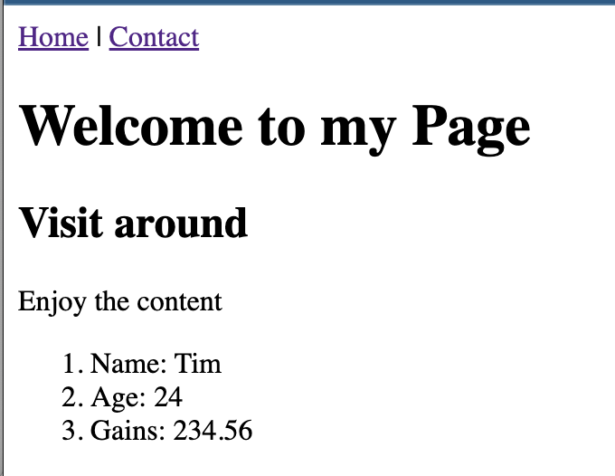

# Django Static Pages with no Templates

 Create 4 web pages with no style, each page should have the following tags:
        
 1. nav with anchor tags for every page, use | as separator
 2. h1
 3. h2
 4. p
   

Submit repo with markdown file with blocks of code for: 
* views.py
* urls.py
* settings.py (INSTALLED_APPS only)

Include screenshots for every page.

Use only django.http.HttpResponse, for every page add any of these data (include name and values for every element using f strings with ol or ul tags):

* 3 variables with different data types
* a list of mixed data types of length 6
* a dictionary with string keys and different data types of length 5

## Exemple
### code

config/settings.py
```Python
# Application definition

INSTALLED_APPS = [
    'django.contrib.admin',
    'django.contrib.auth',
    'django.contrib.contenttypes',
    'django.contrib.sessions',
    'django.contrib.messages',
    'django.contrib.staticfiles',
    'static_pages_no_templates',
]

```

config/urls.py
```Python
from django.contrib import admin
from django.urls import path
from static_pages_no_templates import views

urlpatterns = [
    path('', views.home, name="home"),
    path('contact/', views.contact, name="contact"),
]

```


static_pages_no_templates/views.py
```Python
from django.shortcuts import render
from django.http import HttpResponse

nav = """
    <nav>
        <a href='/'>Home</a> |
        <a href='contact/'>Contact</a>
    </nav>
"""
name = "Tim"
age = 24
gains = 234.5634224

home_body = f"""
    <ol>
        <li>Name: {name}</li>
        <li>Age: {age}</li>
        <li>Gains: {gains:.2f}</li>
    </ol>
    
"""


def home(request):
    content= """
            <h1>Welcome to my Page</h1>
            <h2>Visit around</h2>
            <p>Enjoy the content</p>
    """
    
    return HttpResponse(nav + content + home_body)

def contact(request):
    return HttpResponse(nav + "Contact Us")

```

### Rendering

Home page


Contact Page

