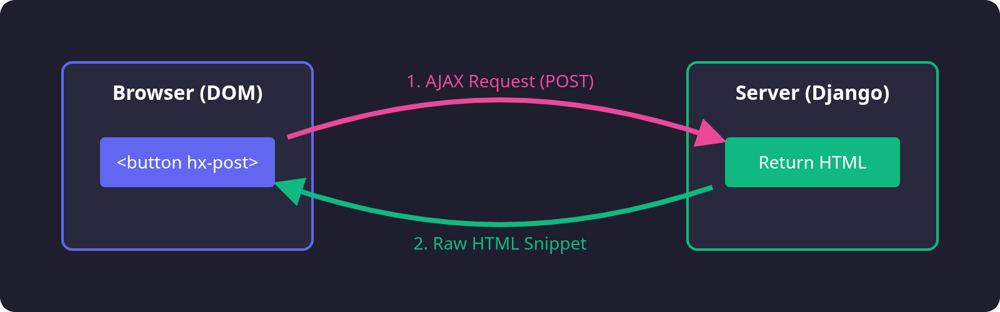
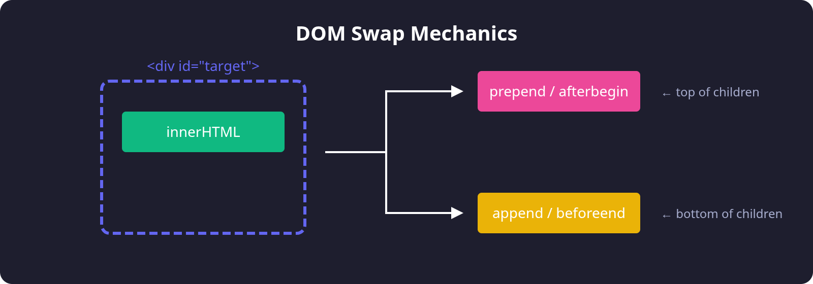
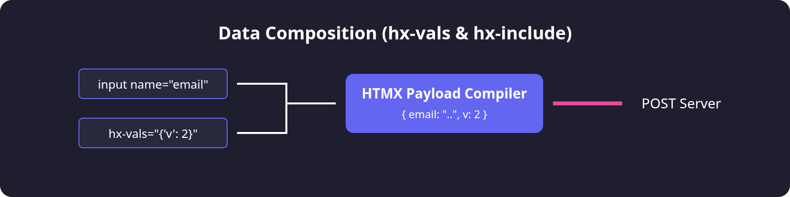

# The HTMX API: Architecture & Examples

## 1. The Communicators: Request Verbs
**Attributes:** `hx-get`, `hx-post`, `hx-put`, `hx-patch`, `hx-delete`

These attributes define *what* type of HTTP request is sent to the server. By applying them to any HTML element (not just forms or anchors), you transform static elements into interactive nodes.




### 4 Practical Examples

**1. Loading a modal panel (`hx-get`)**
Fetching HTML fragments asynchronously to show a pop-up.
```html
<button hx-get="/components/settings-modal/" hx-target="#modal-container">
  Open Settings
</button>
```

**2. Submitting a Form without reloading (`hx-post`)**
Taking form inputs and transmitting them silently.
```html
<form hx-post="/users/create/" hx-target="#user-list" hx-swap="beforeend">
  <input name="username" type="text" />
  <button type="submit">Create User</button>
</form>
```

**3. Toggling a Feature Flag (`hx-patch`)**
Using `hx-patch` is semantically correct for partial backend updates (like boolean toggles).
```html
<input type="checkbox" checked
       hx-patch="/api/feature/dark-mode/toggle/">
```

**4. Deleting a Row (`hx-delete`)**
Directly mapping a UI delete button to a RESTful delete endpoint.
```html
<button hx-delete="/documents/42/" hx-confirm="Delete document 42?">
  Trash
</button>
```

---

## 2. Destinations & Manipulations
**Attributes:** `hx-target`, `hx-swap`, `hx-swap-oob`

Once the server responds with HTML, HTMX needs to know *where* to put it (`hx-target`) and *how* to place it there (`hx-swap`).




### 4 Practical Examples

**1. Targeting an adjacent element (`hx-target`)**
You can update elements outside the button you just clicked using standard CSS Selectors.
```html
<!-- Clicks here... -->
<button hx-get="/user/123/stats/" hx-target="#stats-panel">Load Stats</button>

<!-- ...updates here. -->
<div id="stats-panel">Empty</div>
```

**2. Chat Window Append (`hx-swap="beforeend"`)**
Appends new chat messages to the bottom of the list without deleting the old messages.
```html
<form hx-post="/chat/send/" hx-target="#chat-messages" hx-swap="beforeend">
  <input name="msg">
</form>
<ul id="chat-messages">
  <li>Hello!</li>
</ul>
```

**3. Disappearing Elements (`hx-swap="outerHTML"`)**
If a server returns an empty response `""` paired with `outerHTML`, HTMX physically deletes the tag from the page.
```html
<div class="alert">
  Message sent successfully! 
  <button hx-delete="/dismiss/" hx-target="closest .alert" hx-swap="outerHTML">X</button>
</div>
```

**4. Out-of-Band Global Swap (`hx-swap-oob`)**
The server's response contains a bonus HTML element marked with `hx-swap-oob="true"`. HTMX finds the corresponding ID anywhere on the page and updates it silently.
```html
<!-- Inside the SERVER RESPONSE payload -->
<div id="primary-form">Saved!</div>
<div id="shopping-cart-counter" hx-swap-oob="true">
  4 items
</div>
```

---

## 3. The Instigators: Flow & Logic
**Attributes:** `hx-trigger`, `hx-sync`

Controls exactly *when* an AJAX request fires, establishing debouncing delays, scroll-based triggers, and concurrency control.


### 4 Practical Examples

**1. Typeahead / Live Search (`delay:500ms`)**
Wait until the user finishes typing before blasting the database with search queries.
```html
<input type="search" name="q" 
       hx-post="/search/" 
       hx-trigger="keyup delay:500ms changed" 
       hx-target="#search-results">
```

**2. Infinite Scroll (`revealed`)**
Fires automatically when the user scrolls down enough for the element to enter the viewport.
```html
<tr hx-get="/rows/?page=2" hx-trigger="revealed" hx-swap="afterend">
  <td>Last row of page 1...</td>
</tr>
```

**3. Web Sockets / Event Polling (`every Xs`)**
Create self-updating dashboards without writing setInterval logic in JS.
```html
<div hx-get="/api/live-stats/" hx-trigger="every 5s">
  Live stats loading...
</div>
```

**4. Drop spamming requests (`hx-sync`)**
If a user violently double-clicks "Submit", HTMX natively blocks the second click until the first server response comes back.
```html
<form hx-post="/checkout/" hx-sync="this:drop">
  <button type="submit">Pay Now</button>
</form>
```

---

## 4. User Experience & Feedback
**Attributes:** `hx-indicator`, `hx-disabled-elt`, `hx-preserve`

Modern apps require spin-loaders and button locking during data transmission. HTMX automates these CSS class toggles seamlessly.


### 4 Practical Examples

**1. Activating a local Spinner (`hx-indicator`)**
A CSS spinner inside the button stays hidden (`opacity: 0`). During the request, HTMX forces it to appear.
```html
<button hx-post="/process/" hx-indicator="#spin">
  Process Data 
</button>
```

**2. Globally freezing the UI (`hx-disabled-elt`)**
Disable an entire `fieldset` or container, preventing users from altering form data while the submission is processing.
```html
<form hx-post="/checkout/" hx-disabled-elt="fieldset">
  <fieldset>
    <input type="text" name="cc_num">
    <button>Submit</button>
  </fieldset>
</form>
```

**3. Preserving an Audio Player (`hx-preserve`)**
If the outer DOM `div` is updated, the internal audio element ignores the replacement, meaning the user's podcast isn't interrupted!
```html
<div id="content-container" hx-get="/next-page/" hx-trigger="click">
   <!-- Swapped when the user navigates! -->
   <audio id="global-player" src="music.mp3" hx-preserve controls autoplay></audio>
</div>
```

**4. Retargeting on errors (`hx-target-error` via `hx-ext`)**
Combined with the `response-targets` extension, gracefully capture server 404s without exploding the primary UI box.
```html
<form hx-post="/login" 
      hx-target="#success-dashboard" 
      hx-target-401="#error-banner"
      hx-ext="response-targets">
  ...
</form>
<div id="error-banner"></div> <!-- Incorrect password ends up here! -->
```

---

## 5. Navigation & Parameters
**Attributes:** `hx-push-url`, `hx-replace-url`, `hx-vals`, `hx-include`, `hx-params`

Control exactly what JSON payload leaves your client, and manipulate the browser's address bar logic without needing a JS Router.



### 4 Practical Examples

**1. SPA Routing (`hx-push-url`)**
Clicking an anchor updates a `<div>`, but also pushes the new `/about/` URL to the browser's address bar history API natively.
```html
<a hx-get="/about/" hx-target="#main-content" hx-push-url="true">
  About Us
</a>
```

**2. Passing Hidden Keys (`hx-vals`)**
Inject static security tokens or analytical keys directly into the GET/POST dictionary payload.
```html
<button hx-post="/checkout/" hx-vals='{"coupon_code": "DISCOUNT20"}'>
  Buy
</button>
```

**3. Constructing Payloads outside Forms (`hx-include`)**
Select sibling `<input>` tags using a CSS selector to build the form data dynamically.
```html
<input type="text" id="name" name="first_name" />
<button hx-post="/save" hx-include="#name">
  Save Name
</button>
```

**4. Filtering Form Bloat (`hx-params`)**
Forms submit *everything*. If you have a huge hidden `base64` image you *don't* want sent to an autocomplete search endpoint, drop it!
```html
<form hx-post="/search/" hx-params="not heavy_image_field">
  <input name="search_query">
  <input type="hidden" name="heavy_image_field" value="base64.....">
</form>
```